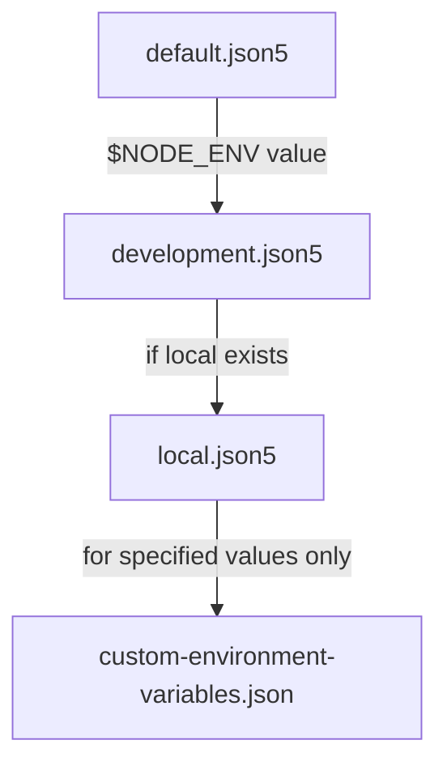

# RIF Relay Server

This typescript repository contains all the server code used by the RIF Relay System.

This project works as a dependency as well as a stand-alone project.

## Table of Contents

- [RIF Relay Server](#rif-relay-server)
  - [Table of Contents](#table-of-contents)
  - [Installation](#installation)
    - [Pre-requisites](#pre-requisites)
    - [Dependencies](#dependencies)
  - [How to use it](#how-to-use-it)
    - [Server configuration](#server-configuration)
    - [Overrides](#overrides)
    - [Start server](#start-server)
    - [Server registration](#server-registration)
    - [Execute as a Docker container](#execute-as-a-docker-container)
  - [How to use it as library](#how-to-use-it-as-library)
    - [Use a release version](#use-a-release-version)
    - [Use a local distributable](#use-a-local-distributable)
  - [Development](#development)
    - [Testing](#testing)
    - [Husky and linters](#husky-and-linters)
    - [Generating a new distributable version](#generating-a-new-distributable-version)
      - [For GitHub](#for-github)
      - [For NPM](#for-npm)

---

## Installation

### Pre-requisites

- Node version 16.x
- RSKj Running Node.
  - **Note: To work properly with this server in Regtest, please use the RSKj configuration that can be found [here](https://github.com/rsksmart/rif-relay/blob/develop/docker/node.conf).**
- [RIF Relay Contracts](https://github.com/rsksmart/rif-relay-contracts) deployed

### Dependencies

Just run `npm install` to install all dependencies.

---

## How to use it

### Server configuration

To start the relay server, you first need a configuration file. This is loaded using [node-config](https://github.com/node-config/node-config) package from `./config` folder.

We prepared some defaults for testnet and mainnet, however to run it locally, or to use custom settings, you'd need to create a new file in `./config` and prepend
`NODE_ENV=<config_file_name>` to the execution command.
File [./config/default.json5](config/default.json5) contains all configuration properties and their descriptions.

<details open>
<summary><small>./config/default.json5</small></summary>

```json5
// config/default.json5

// TODO: add descriptions in comments
// This file should not be aimed at any specific environment, but rather contain configuration defaults that are not likely to cause issues if left undefined in an override
{
  /*
    Server 
  */
  app: {
    url: "http://127.0.0.1", // URL where the relay server will be deployed, it could be localhost or the IP of the host machine.
    port: 8090, // port where the relay server will be hosted.
    devMode: false, // indicates to the server if we are in development mode or not.
    customReplenish: false, // set if the server uses a custom replenish function or not.

    logLevel: 4 /* The log level for the relay server. Available levels:
      {
        TRACE: 0;
        DEBUG: 1;
        INFO: 2;
        WARN: 3;
        ERROR: 4;
        SILENT: 5;
      }
    */,
    workdir: ".", // path to the folder where the server will store the database and all its data.
    readyTimeout: 30000,
    checkInterval: 10000,
    disableSponsoredTx: false,
    
    /* It's the fee that the fee collector will take from the execution of 
    transfer() or transferFrom() functions.
    - This value should be expressed as a fraction, i.e. 0.1 means 10% of the value being transfered
    and 0.01 means 1% of the value being transfered.
    - This value has priority over gasFeePercentage. If transferFeePercentage is properly configured and the execution
    is a tranfer or transferFrom, gasFeePercentage will be ignored even if transferFeePercentage = 0.
    - Negative values disable this fee.
    */
    transferFeePercentage: -1,
    /* Sets the fee value (%) that the worker will take from all transactions 
    based on the total amount of gas used.
    - Under certain conditions, this value will be ignored. See transferFeePercentage above to know more about it.
    - the fee will be added to the estimated gas and required in the transaction amount.
    - the percentage is represented as a fraction (1 = 100%) string to allow for very low or high percentages
    - fractions exceeding the number of decimals of that of the native currency will be rounded up
   */
    gasFeePercentage: 0,
    /* It's a fixed fee that the feeCollector takes from all the operations regardless of their 
   nature (deploy, relay, transfer, transferFrom, etc.). For example, if fixedUsdFee = 1.5, every transaction
   will pay an additional fee of 1.5USD.
   - This fee is not exclusive. If gasFeePercentage or transferFeePercentage is configured, fixedUsdFee will be
   an additional fee, so the total amount will be initialGasEstimation + gasFee (or transferFee) + fixedFee.
   */
   fixedUsdFee: 0 ,

   sponsoredDestinations: [],
   requestMinValidSeconds: 43200,
    
  },
  /*
    Blockchain node
  */
  blockchain: {
    rskNodeUrl: "http://127.0.0.1:4444", //  RSK node endpoint URL, where the RSK node is located.
    gasPriceFactor: 1,
    alertedBlockDelay: 0,
    minAlertedDelayMS: 0,
    maxAlertedDelayMS: 0,
    registrationBlockRate: 0,
    workerMinBalance: 0.001e18, // 0.001 RBTC
    workerTargetBalance: 0.003e18, // 0.003 RBTC
    managerMinBalance: 0.001e18, // 0.001 RBTC
    managerMinStake: 1, // 1 wei
    managerTargetBalance: 0.003e18, // 0.003 RBTC
    minHubWithdrawalBalance: 0.001e18, // 0.001 RBTC
    refreshStateTimeoutBlocks: 5,
    pendingTransactionTimeoutBlocks: 30, // around 5 minutes with 10 seconds block times.
    successfulRoundsForReady: 3, // successful mined blocks to become ready after exception.
    confirmationsNeeded: 12,
    retryGasPriceFactor: 1.2, // gas price factor used to calculate the gas on the server, you can leave it as 1
    defaultGasLimit: 500000,
    maxGasPrice: 100000000000,
    estimateGasFactor: 1.2,
    initialBlockToScan: 1, // the first block to scan to look for events
    maxBlockRange: 1000   // the maximum amount of blocks to include while requesting events
  },
  /*
    Relay contracts addresses
  */
  contracts: {
    relayHubAddress: "0x0000000000000000000000000000000000000000", // relay hub contract address, you can retrieve this from the contract summary.
    relayVerifierAddress: "0x0000000000000000000000000000000000000000", // relay verifier contract address, you can retrieve this from the contract summary.
    deployVerifierAddress: "0x0000000000000000000000000000000000000000", // deploy verifier contract address, you can retrieve this from the contract summary.
    feesReceiver: "0x0000000000000000000000000000000000000000",
    trustedVerifiers: [],
  },
  register: {
    stake: "0.01", // amount of stake to set up
    funds: "0.02", // amount of funds to set up
    mnemonic: "", // mnemonic to use for unlocking the account parameter; DO NOT STORE IT HERE, use REGISTER_MNEMONIC as env variable. 
    privateKey: "", // private key to retrieve the account address from; DO NOT STORE IT HERE, use REGISTER_PRIVATE_KEY as env variable. 
    relayHub: "",
    gasPrice: 60000000,
    unstakeDelay: 1000,
  },
}

```

</details>

> ### :warning: Warning
>
> Keep in mind, that the if `local` configuration exists, it WILL OVERWRITE any other configuration files loaded using NODE_ENV.
>
> Also note that `development` is the default NODE_ENV value.
> The following depicts the order in which the [node-config](https://github.com/node-config/node-config/wiki/Strict-Mode#node_env-value-of-local-is-ambiguous) library merges configuration, starting from the least to the most specific config:



> Consult the [node-config file load order documentation](https://github.com/node-config/node-config/wiki/Configuration-Files#file-load-order) for more details about config load order.

### Overrides

Some of these options will be overrideable using environment variables defined in [./config/custom-environment-variables.json](config/custom-environment-variables.json) file.

<details open>
<summary><small>./config/custom-environment-variables.json</small></summary>

```json5
// config/custom-environment-variables.json

{
  "register": {
    "stake": "REGISTER_STAKE",
    "funds": "REGISTER_FUNDS",
    "mnemonic": "REGISTER_MNEMONIC",
    "privateKey": "REGISTER_PRIVATE_KEY",
    "hub": "REGISTER_HUB_ADDRESS",
    "gasPrice": "REGISTER_GAS_PRICE",
    "unstakeDelay": "REGISTER_UNSTAKE_DELAY"
  }
}

```

> ### :warning: Warning
>
> Keep in mind that neither `mnemonic` or `privateKey` are intended to be set in the file directly and doing it can lead to security issues. Please refer to the [server registration section](#server-registration) for further details.

</details>

To use these overrides, you'd prepend an environment variable, e.g.:

```shell
REGISTER_UNSTAKE_DELAY=2000 REGISTER_GAS_PRICE=1000000 npm run register
```

### Start server

Depending on your preferred configuration, start the server with:

```shell
# to use with local instance
npm run start  # This will use development.json5 first, if one exists

# to use for testnet deployment
NODE_ENV=testnet npm run start

# to use for mainnet deployment
NODE_ENV=mainnet npm run start

# or your own
NODE_ENV=ferko_mrkvicka npm run start
```

You can browse the `getAddr` endpoint (e.g. by doing `curl` to `http://localhost:8090/getaddr`) to verify the server is running correctly as well as visualize some useful information:

```json
{
  "relayWorkerAddress": "0xe722143177fe9c7c58057dc3d98d87f6c414dc95",
  "relayManagerAddress": "0xe0820002dfaa69cbf8add6a738171e8eb0a5ee54",
  "relayHubAddress": "0x38bebd507aBC3D76B10d61f5C95668e1240D087F",
  "minGasPrice": "6000000000",
  "chainId": "31",
  "networkId": "31",
  "ready": false,
  "version": "2.0.1"
}
```

If it's the first time the server is run, some logs will state that the server isn't ready and that some values are wrong. This is expected, you just need to register the server on the relay hub in order for it to be usable by the clients.

### Server registration

Once the relay server is up, you need to register it in order for it to be usable. The `./config/default.json5` config file contains configuration definitions for this too. You can either store them in your own [config](#server-configuration), or [override](#overrides) them with environment variables.

```shell
# to use with local instance
NODE_ENV=local npm run register

# to use for testnet deployment
NODE_ENV=testnet npm run register

# to use for mainnet deployment
NODE_ENV=mainnet npm run register

# or your own env
NODE_ENV=ferko_mrkvicka npm run register
```

After this you will see several log entries indicating the registration progress. After a little while, look for this entry in the relay server execution terminal to make sure that the server is ready:

```text
Relayer state: READY
```

> ### :warning: Warning
>
> Keep in mind that there are different ways to specify the keys during the registration steps.
> 1. If nothing is specified, the register scrips tries to retrieve the signer from the RPC accounts configured in the node; this method is enabled for development purposes only (Regtest)
> 2. The user could use either a private key or a mnemonic using the [custom environment variable method](#overrides) hence by specifying `REGISTER_PRIVATE_KEY` or `REGISTER_MNEMONIC` as environment variables (e.g.: `REGISTER_PRIVATE_KEY="0xabc123" npm run register` or `REGISTER_MNEMONIC="word1 word2 etc..." npm run register`).

### Execute as a Docker container

You can run the server as a Docker container. Docker and Docker compose should be installed and an RSK Node should be running.
After modifying the config-file as indicated [here](#server-configuration), an additional modification should be made in the same file as follows:

For Mac users:

```json5
  // in your config override file
  rskNodeUrl: "http://host.docker.internal:4444",
```

For Linux users:

```json5
  // in your config override file
  rskNodeUrl: "http://172.17.0.1:4444",
```

In both cases, edit your local hosts file to make the address above resolve as 127.0.0.1.

Then run:

```shell
NODE_ENV=<name> docker-compose build && NODE_ENV=<name> docker-compose up
```

After that, you need to login into the running container `docker exec -it <container_name> bash`. To get the container name, you need to run `docker-compose ps` in the project folder. Once you logged in the running container, you need to run the register command:

```shell
<VARIABLE_LIST> node dist/commands/Register.js
```

where `VARIABLE_LIST` can contains any of the variables defined in the [override](#overrides) section.

Please remember that, in oder to properly register the server, you need to specify at least the following environment variables:

- REGISTER_MNEMONIC or REGISTER_PRIVATE_KEY.

---

## Use a local distributable

Clone this repository inside your project's root folder and use the `npm link` mechanism (<https://docs.npmjs.com/cli/v8/commands/npm-link>) to add it to your project.

---

## Development

Make your modifications and then run `npm run dist` to validate them.
When you are done with your changes, you can publish them by creating a distributable version.

### Testing

The relay server scripts define three testing strategies:

1. `test:unit` - runs one-off unit tests within the `./test/unit/` directory
2. `test:integration` - runs one-off integration tests within the `./test/integration` directory
3. `tdd` - runs unit tests in watch mode. Watches all **ts** files in the project

In addition, the `TRACE_LOG=true` environment variable may be used to use the trace log level in the tests `;]`. This will print a lot of logs from the codebase.

### Husky and linters

We use husky to check linters and code styles on commits, if you commit your
changes and the commit fails on lint or prettier checks you can use these command
to check and fix the errors before trying to commit again:

- `npm run lint` to check linter bugs
- `npm run lint:fix` to fix linter bugs
- `npm run prettier` to check code-style errors
- `npm run prettier:fix` to fix code-style errors

#### For GitHub

1. Create a new release with the new version (remember to update `package.json`).
